# 梦幻西游全装备Icon图鉴

> 本图鉴收集了梦幻西游全等级（10～160级）装备名称与Icon。数据来源：[梦幻西游官网](https://xyq.163.com/introduce/dj004.html)。
> 所有图片保存在本地 `icons/` 文件夹。

---

## 武器总表

> 17种武器类型 × 16个等级（10～160），同类型按等级从低到高排列。
> 90-110级在官网标注为"90-150"造型，120-140级标注为"120-150强化打造"。

| 等级 | 刀 | 刀Icon | 剑 | 剑Icon | 双剑 | 双剑Icon | 斧钺 | 斧钺Icon | 扇 | 扇Icon | 锤 | 锤Icon | 鞭 | 鞭Icon | 环圈 | 环圈Icon | 爪刺 | 爪刺Icon | 飘带 | 飘带Icon | 魔棒 | 魔棒Icon | 法杖 | 法杖Icon | 宝珠 | 宝珠Icon | 弓箭 | 弓箭Icon | 伞 | 伞Icon | 灯笼 | 灯笼Icon | 巨剑 | 巨剑Icon |
| --- | --- | --- | --- | --- | --- | --- | --- | --- | --- | --- | --- | --- | --- | --- | --- | --- | --- | --- | --- | --- | --- | --- | --- | --- | --- | --- | --- | --- | --- | --- | --- | --- | --- | --- |
| 10 | 苗刀 | 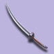 | 铁齿剑 |  | 镔铁双剑 | 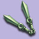 | 开山斧 | 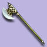 | 铁骨扇 |  | 镔铁锤 | 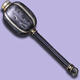 | 牛筋鞭 | 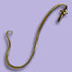 | 精钢日月圈 |  | 天狼爪 | 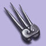 | 幻彩银纱 | 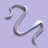 | 金丝魔棒 | 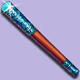 | 红木杖 | 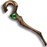 | 水晶珠 |  | 铁胆弓 | 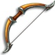 | 红罗伞 | 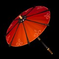 | 竹骨灯 | 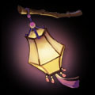 | 桃印铁刃 | 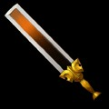 |
| 20 | 夜魔弯刀 | 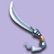 | 吴越剑 |  | 龙凤双剑 | 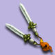 | 双面斧 | 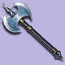 | 精钢扇 |  | 八棱金瓜 | 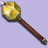 | 乌龙鞭 | 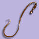 | 离情环 | 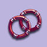 | 幽冥鬼爪 | 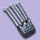 | 金丝彩带 | 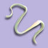 | 玉如意 | 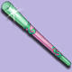 | 白椴杖 | 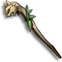 | 珍宝珠 |  | 紫檀弓 | 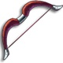 | 紫竹伞 | 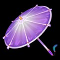 | 红灯笼 | 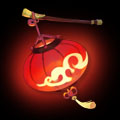 | 赭石巨剑 | 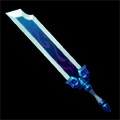 |
| 30 | 金背大砍刀 | 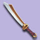 | 青锋剑 | 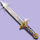 | 竹节双剑 | 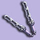 | 双弦钺 | 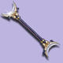 | 铁面扇 | 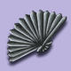 | 狼牙锤 | 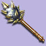 | 钢结鞭 | 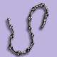 | 金刺轮 | 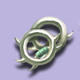 | 青龙牙 | 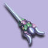 | 无极丝 |  | 点金棒 |  | 墨铁拐 | 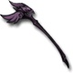 | 翡翠珠 |  | 宝雕长弓 | 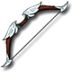 | 锦绣帷 | 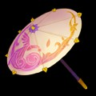 | 鲤鱼灯 |  | 璧玉长铗 |  |
| 40 | 雁翅刀 | 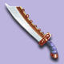 | 龙泉剑 | 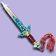 | 狼牙双剑 | 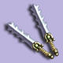 | 精钢禅钺 | 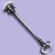 | 百折扇 |  | 烈焰锤 |  | 蛇骨鞭 | 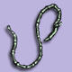 | 风火圈 | 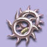 | 勾魂爪 | 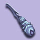 | 天蚕丝带 |  | 云龙棒 | 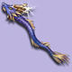 | 玄铁牛角杖 | 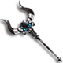 | 莲华珠 |  | 錾金宝弓 | 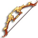 | 幽兰帐 | 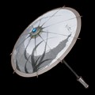 | 芙蓉花灯 |  | 青铜古剑 |  |
| 50 | 破天宝刀 |  | 黄金剑 |  | 鱼骨双剑 |  | 黄金钺 |  | 劈水扇 |  | 破甲战锤 |  | 玉竹金铃 |  | 赤炎环 |  | 玄冰刺 |  | 云龙绸带 |  | 幽路引魂 |  | 鹰眼法杖 |  | 夜灵珠 |  | 玉腰弯弓 |  | 琳琅盖 |  | 如意宫灯 |  | 金错巨刃 |  |
| 60 | 狼牙刀 |  | 游龙剑 |  | 赤焰双剑 |  | 乌金鬼头镰 |  | 神火扇 |  | 震天锤 |  | 青藤柳叶鞭 |  | 蛇形月 |  | 青刚刺 |  | 七彩罗刹 |  | 满天星 |  | 腾云杖 |  | 如意宝珠 |  | 连珠神弓 |  | 孔雀羽 |  | 玲珑盏 |  | 惊涛雪 |  |
| 70 | 龙鳞宝刀 |  | 北斗七星剑 |  | 墨玉双剑 |  | 狂魔镰 |  | 阴风扇 |  | 巨灵神锤 |  | 雷鸣嗜血鞭 |  | 子母双月 |  | 华光刺 |  | 缚神绫 |  | 水晶棒 |  | 引魂杖 |  | 沧海明珠 |  | 游鱼戏珠 |  | 金刚伞 |  | 玉兔盏 |  | 醉浮生 |  |
| 80 | 黑炎魔刀 |  | 碧玉剑 |  | 梅花双剑 |  | 恶龙之齿 |  | 风云雷电 |  | 天崩地裂 |  | 混元金钩 |  | 斜月狼牙 |  | 龙鳞刺 |  | 九天仙绫 |  | 日月光华 |  | 碧玺杖 |  | 无量玉璧 |  | 灵犀望月 |  | 落梅伞 |  | 冰心盏 |  | 沉戟天戉 |  |
| 90 | 冷月 |  | 鱼肠 |  | 阴阳 |  | 破魄 |  | 太极 |  | 八卦 |  | 龙筋 |  | 如意 |  | 撕天 |  | 彩虹 |  | 沧海 |  | 业焰 |  | 离火 |  | 非攻 |  | 鬼骨 |  | 蟠龙 |  | 昆吾 |  |
| 100 | 屠龙 |  | 倚天 |  | 月光 |  | 肃魂 |  | 玉龙 |  | 鬼牙 |  | 百花 |  | 乾坤 |  | 毒牙 |  | 流云 |  | 红莲 |  | 玉辉 |  | 飞星 |  | 幽篁 |  | 云梦 |  | 云鹤 |  | 弦歌 |  |
| 110 | 血刃 |  | 湛卢 |  | 灵蛇 |  | 无敌 |  | 秋风 |  | 雷神 |  | 吹雪 |  | 月光 |  | 胭脂 |  | 碧波 |  | 盘龙 |  | 鹿鸣 |  | 月华 |  | 百鬼 |  | 枕霞 |  | 风荷 |  | 鸦九 |  |
| 120 | 偃月青龙 |  | 魏武青虹 |  | 金龙双剪 |  | 五丁开山 |  | 画龙点睛 |  | 混元金锤 |  | 游龙惊鸿 |  | 别情离恨 |  | 九阴勾魂 |  | 秋水落霞 |  | 降魔玉杵 |  | 庄周梦蝶 |  | 回风舞雪 |  | 冥火薄天 |  | 碧火琉璃 |  | 金风玉露 |  | 秋水澄流 |  |
| 130 | 晓风残月 |  | 灵犀神剑 |  | 连理双树 |  | 元神禁锢 |  | 秋水人家 |  | 九瓣莲花 |  | 仙人指路 |  | 金玉双环 |  | 雪蚕之刺 |  | 晃金仙绳 |  | 青藤玉树 |  | 凤翼流珠 |  | 紫金葫芦 |  | 龙鸣寒水 |  | 雪羽穿云 |  | 凰火燎原 |  | 腾蛇郁刃 |  |
| 140 | 斩妖泣血 |  | 四法青云 |  | 祖龙对剑 |  | 护法灭魔 |  | 逍遥江湖 |  | 鬼王蚀日 |  | 血之刺藤 |  | 九天金线 |  | 贵霜之牙 |  | 此最相思 |  | 墨玉骷髅 |  | 雪蟒霜寒 |  | 裂云啸日 |  | 太极流光 |  | 月影星痕 |  | 风露清愁 |  | 墨骨枯麟 |  |
| 150 | 业火三灾 |  | 霜冷九州 |  | 紫电青霜 |  | 碧血干戚 |  | 浩气长舒 |  | 狂澜碎岳 |  | 牧云清歌 |  | 无关风月 |  | 忘川三途 |  | 揽月摘星 |  | 丝萝乔木 |  | 碧海潮生 |  | 云雷万里 |  | 九霄风雷 |  | 浮生归梦 |  | 夭桃秾李 |  | 百辟镇魂 |  |
| 160 | 鸣鸿 |  | 擒龙 |  | 浮犀 |  | 裂天 |  | 星瀚 |  | 碎寂 |  | 霜陨 |  | 朝夕 |  | 离钩 |  | 九霄 |  | 醍醐 |  | 弦月 |  | 赤明 |  | 若木 |  | 晴雪 |  | 荒尘 |  | 长息 |  |

> **备注：**
> - 双剑150级还有乾坤造型「罗喉计都」，160级乾坤造型「非天」
> - 原文件中"宝珠/弓箭/法杖"和"巨剑/弩"的分类与官网不一致，本表已按官网校正：
>   - 官网 **法杖** = 原"宝珠"（业焰、玉辉、鹿鸣…弦月）
>   - 官网 **宝珠** = 原"弓箭"（离火、飞星、月华…赤明）
>   - 官网 **弓箭** = 原"法杖"（非攻、幽篁、百鬼…若木）
>   - 官网 **灯笼** = 原"巨剑"（蟠龙、云鹤、风荷…荒尘）
>   - 官网 **巨剑** = 原"弩"（昆吾、弦歌、鸦九…长息）

---

## 头盔

| 等级 | 名称 | Icon |
| --- | --- | --- |
| 10 | 布帽 |  |
| 20 | 面具 |  |
| 30 | 纶巾 |  |
| 40 | 缨络丝带 |  |
| 50 | 羊角盔 |  |
| 60 | 水晶帽 |  |
| 70 | 乾坤帽 |  |
| 80 | 黑魔冠 |  |
| 90 | 白玉龙冠 |  |
| 100 | 水晶夔帽 |  |
| 110 | 翡翠曜冠 |  |
| 120 | 金丝黑玉冠 |  |
| 130 | 白玉琉璃冠 |  |
| 140 | 兽鬼珐琅面 |  |
| 150 | 紫金磐龙冠 |  |
| 160 | 浑天玄火盔 |  |

---

## 发钗（女头）

| 等级 | 名称 | Icon |
| --- | --- | --- |
| 10 | 玉钗 |  |
| 20 | 梅花簪子 |  |
| 30 | 珍珠头带 |  |
| 40 | 凤头钗 |  |
| 50 | 媚狐头饰 |  |
| 60 | 玉女发冠 |  |
| 70 | 魔女发冠 |  |
| 80 | 七彩花环 |  |
| 90 | 凤翅金翎 |  |
| 100 | 寒雉霜蚕 |  |
| 110 | 曜月嵌星 |  |
| 120 | 郁金流苏簪 |  |
| 130 | 玉翼附蝉翎 |  |
| 140 | 鸾羽九凤冠 |  |
| 150 | 金珰紫焰冠 |  |
| 160 | 乾元鸣凤冕 |  |

---

## 铠甲

| 等级 | 名称 | Icon |
| --- | --- | --- |
| 10 | 皮衣 |  |
| 20 | 鳞甲 |  |
| 30 | 锁子甲 |  |
| 40 | 紧身衣 |  |
| 50 | 钢甲 |  |
| 60 | 夜魔披风 |  |
| 70 | 龙骨甲 |  |
| 80 | 死亡斗篷 |  |
| 90 | 神谕披风 |  |
| 100 | 珊瑚玉衣 |  |
| 110 | 金蚕披风 |  |
| 120 | 乾坤护心甲 |  |
| 130 | 蝉翼金丝甲 |  |
| 140 | 金丝鱼鳞甲 |  |
| 150 | 紫金磐龙甲 |  |
| 160 | 混元一气甲 |  |

---

## 女衣（女铠甲）

| 等级 | 名称 | Icon |
| --- | --- | --- |
| 10 | 丝绸长裙 |  |
| 20 | 五彩裙 |  |
| 30 | 龙鳞羽衣 |  |
| 40 | 天香披肩 |  |
| 50 | 金缕羽衣 |  |
| 60 | 霓裳羽衣 |  |
| 70 | 流云素裙 |  |
| 80 | 七宝天衣 |  |
| 90 | 飞天羽衣 |  |
| 100 | 穰花翠裙 |  |
| 110 | 金蚕丝裙 |  |
| 120 | 紫香金乌裙 |  |
| 130 | 碧霞彩云衣 |  |
| 140 | 金丝蝉翼衫 |  |
| 150 | 五彩凤翅衣 |  |
| 160 | 鎏金浣月衣 |  |

---

## 鞋子

| 等级 | 名称 | Icon |
| --- | --- | --- |
| 10 | 牛皮靴 |  |
| 20 | 马靴 |  |
| 30 | 侠客履 |  |
| 40 | 神行靴 |  |
| 50 | 绿靴 |  |
| 60 | 追星踏月 |  |
| 70 | 九州履 |  |
| 80 | 万里追云履 |  |
| 90 | 踏雪无痕 |  |
| 100 | 平步青云 |  |
| 110 | 追云逐电 |  |
| 120 | 乾坤天罡履 |  |
| 130 | 七星逐月靴 |  |
| 140 | 碧霞流云履 |  |
| 150 | 金丝逐日履 |  |
| 160 | 辟尘分光履 |  |

---

## 腰带

| 等级 | 名称 | Icon |
| --- | --- | --- |
| 10 | 缎带 |  |
| 20 | 银腰带 |  |
| 30 | 水晶腰带 |  |
| 40 | 琥珀腰链 |  |
| 50 | 乱牙咬 |  |
| 60 | 攫魂铃 |  |
| 70 | 兽王腰带 |  |
| 80 | 八卦锻带 |  |
| 90 | 幻彩玉带 |  |
| 100 | 珠翠玉环 |  |
| 110 | 金蟾含珠 |  |
| 120 | 乾坤紫玉带 |  |
| 130 | 琉璃寒玉带 |  |
| 140 | 蝉翼鱼佩带 |  |
| 150 | 磐龙凤翔带 |  |
| 160 | 紫霄云芒带 |  |

---

## 项链

| 等级 | 名称 | Icon |
| --- | --- | --- |
| 10 | 五色飞石 |  |
| 20 | 珍珠链 |  |
| 30 | 骷髅吊坠 |  |
| 40 | 江湖夜雨 |  |
| 50 | 荧光坠子 |  |
| 60 | 风月宝链 |  |
| 70 | 碧水青龙 |  |
| 80 | 万里卷云 |  |
| 90 | 七彩玲珑 |  |
| 100 | 黄玉琉佩 |  |
| 110 | 鸾飞凤舞 |  |
| 120 | 衔珠金凤佩 |  |
| 130 | 七璜珠玉佩 |  |
| 140 | 鎏金点翠佩 |  |
| 150 | 紫金碧玺佩 |  |
| 160 | 落霞陨星坠 |  |

---

## 灵饰 · 戒指

| 等级 | 名称 | Icon |
| --- | --- | --- |
| 60 | 玲珑指 |  |
| 80 | 琬琰指 |  |
| 100 | 瑞兆指 |  |
| 120 | 含玉指 |  |
| 140 | 流光指 |  |
| 160 | 太华指 |  |

---

## 灵饰 · 耳饰

| 等级 | 名称 | Icon |
| --- | --- | --- |
| 60 | 碧葭耳 |  |
| 80 | 瑜华珰 |  |
| 100 | 五灵珰 |  |
| 120 | 翠玉珰 |  |
| 140 | 云霞珰 |  |
| 160 | 绣娇珰 |  |

---

## 灵饰 · 手镯

| 等级 | 名称 | Icon |
| --- | --- | --- |
| 60 | 碧木镯 |  |
| 80 | 清漪镯 |  |
| 100 | 花影镯 |  |
| 120 | 春韵镯 |  |
| 140 | 清水镯 |  |
| 160 | 霜雪镯 |  |

---

## 灵饰 · 佩饰

| 等级 | 名称 | Icon |
| --- | --- | --- |
| 60 | 琅玕佩 |  |
| 80 | 清韵佩 |  |
| 100 | 五灵佩 |  |
| 120 | 思情佩 |  |
| 140 | 流光佩 |  |
| 160 | 琢玉佩 |  |

---

## 命魂之玉（上古玉魄）

> 2025年4月新增系统。玉魄分阴阳两种，不分装备等级，修炼等级1～15级，属性数值只与修炼等级有关。
> 数据来源：[官网公告](https://xyq.163.com/news/20250416/4999_1227842.html)

| 类型 | 名称 | 说明 |
| --- | --- | --- |
| 阳 | 上古玉魄·阳 | 增加进攻属性（伤害/法伤/速度/物爆/法爆/固伤等），初始1个奇袭特技开光孔 |
| 阴 | 上古玉魄·阴 | 增加防御属性（防御/法防/气血/抗封/治疗等），初始1个奇袭道具开光孔 |
